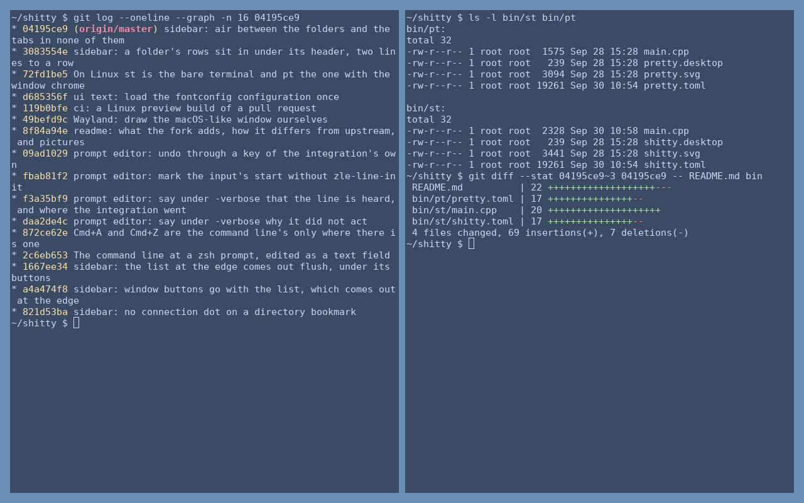
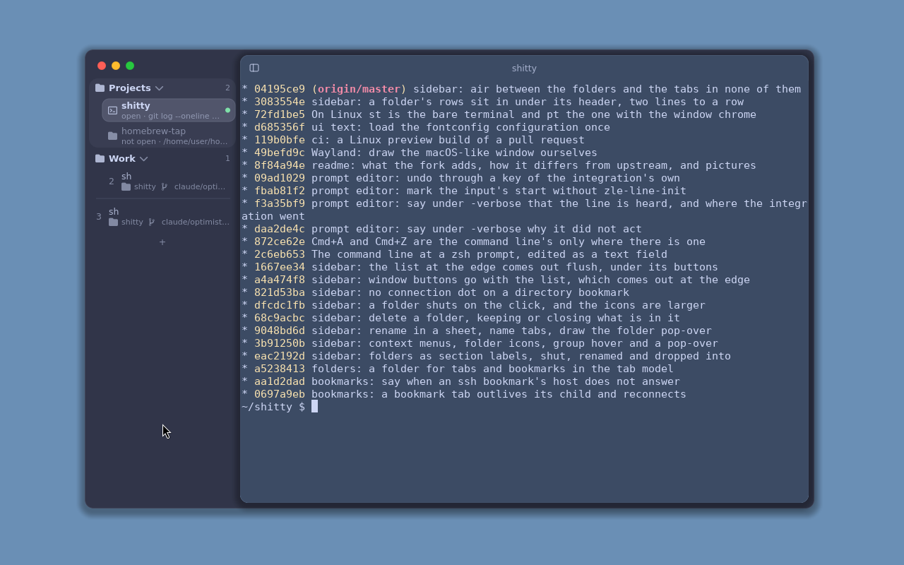
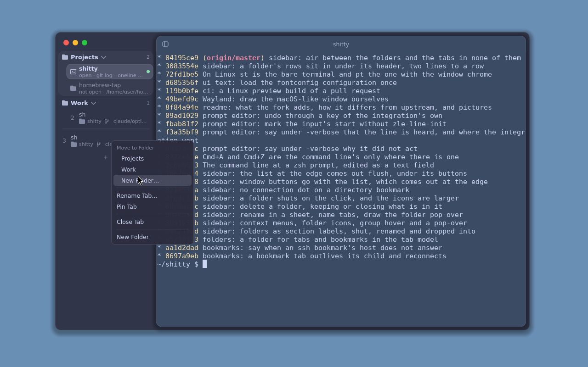

# Shitty / Pretty

[](https://github.com/pg83/shitty/actions/workflows/ci.yml)
[](https://app.codecov.io/gh/pg83/shitty)
[](https://github.com/pg83/shitty/releases/latest)
[](https://github.com/pg83/homebrew-tap)
[](LICENSE)
[](#requirements)
[](#performance)

**Blazingly fast. Memory-unsafe and faster than yours.**

Shitty is built for low latency, fast startup, and predictable resource use.
It keeps terminal state on the CPU and renders cells with native compute
backends: Vulkan on Linux and Metal on macOS.

The same terminal is built with two user-facing brands. `st` is Shitty;
`pt` is Pretty, for people who prefer a polite name. They share all terminal
code and differ only in their name, application identity, config and public
environment names, help/version text, desktop entry, and icon.

## On Linux

Linux gets two terminals from the same code, told apart only by their
defaults.

**`st`, without decorations**: one shell to a window, no title bar, no tabs,
no list and no panes - for a tiling compositor that places the windows and
hands that stay on the keyboard. Every chord a tab or a split would take
(`Ctrl+Shift+T`, `Ctrl+Shift+[`/`]`, `Ctrl+Shift+H`/`J`/`K`/`L`, `Ctrl+Shift+B`)
reaches the program inside. The prompt editor, colour schemes and translucency
are all there.



**`pt`, with decorations**: the Mac's window, drawn by the program itself on
Wayland - the window's buttons over a tab list, the terminal as a rounded panel
with a title bar of its own. The list holds the same things as on the Mac:

- tabs with the running program, the directory and the git branch;
  `Ctrl+Shift+T` opens one, `Ctrl+Shift+[`/`]` go between them, `Ctrl+Shift+W`
  closes one;
- bookmarks from `bookmarks.toml` with their status (open, not open, exited,
  host unreachable), and folders, shut and opened with a click on the header;
- a menu on the right button: on a tab, Move to Folder (with New Folder…),
  Remove from Folder, Rename Tab…, Pin Tab / Unpin Tab / Remove Bookmark, Close
  Tab; on a folder, Show/Hide Contents, Rename Folder…, Delete Folder and Delete
  Folder and Close Tabs; on the empty list, New Tab and New Folder. `↑`/`↓` and
  `Enter` pick from it, `Esc` or a click elsewhere closes it;
- names typed in place: Rename and New Folder turn the row into a text field
  with the old name selected - `Enter` keeps the new one, `Esc` puts the old one
  back, a click elsewhere keeps it. A double click on a folder's header renames
  it too;
- drag and drop: a row dragged onto a folder's header goes into it, between
  rows it goes there, with a line where it will land;
- a folder made here is saved in `bookmarks.toml` as a `[[folder]]` table, so
  it is there after a restart even with nothing in it - its tabs, being
  processes, are not.

`Ctrl+Shift+B` puts the list away and the terminal takes the window; the
pointer at the left edge brings it back over the terminal.





*Captures of the running programs in a headless sway on a software Vulkan
(lavapipe), default colours.*

Either binary can be the other: the difference is `-tabs`, `-panes` and
`-no-decorations`, which `st -help` and `pt -help` show with their defaults,
and any of them can be set in the config file. Not on Linux yet: split panes,
the blur behind the window (the surface is translucent over whatever is
behind) and folder icons, which on the Mac are SF Symbols. A compositor that
insists on drawing its own decorations still draws them around `pt`.

## Performance

100MB catted through the GUI on an Apple-silicon MacBook, every terminal
equalized first: Menlo 12pt, the same 14x28px cell, an 80x24 grid, 500
lines of scrollback. Best wall time of three runs.

Printable ASCII (the scroll path):

| terminal | wall | user | throughput |
|---|---|---|---|
| ghostty 1.3.2-main (nightly) | 0.56s | 0.62s | ~170 MiB/s |
| **shitty** | **0.81s** | 0.50s | **~118 MiB/s** |
| alacritty 0.17.0 | 0.96s | 0.78s | ~99 MiB/s |
| kitty 0.48.2 | 1.28s | 0.95s | ~75 MiB/s |
| ghostty 1.3.1 | 1.49s | 1.60s | ~64 MiB/s |

Random bytes (the parser's worst case, invalid UTF-8 throughout):

| terminal | wall | user | throughput |
|---|---|---|---|
| **shitty** | **1.88s** | 1.79s | **~51 MiB/s** |
| alacritty 0.17.0 | 3.07s | 2.92s | ~31 MiB/s |
| ghostty 1.3.2-main (nightly) | 3.37s | 5.22s | ~28 MiB/s |
| ghostty 1.3.1 | 4.63s | ~7.0s | ~21 MiB/s |
| kitty 0.48.2 | - | - | - |

kitty sits the random payload out: it reacts to the embedded escape junk
with title changes and bells instead of drawing. The ghostty nightly row
is the official tip build (1.3.2-main+1f6e26642), measured at its
author's request - the released 1.3.1 numbers stay for comparison.
Reproduce with [dev/compare.py](dev/compare.py), which verifies the
equalized setup from inside every terminal before measuring anything.

## Why

- **Fast.** See the tables above; `dev/compare.py` reproduces them.
- **Correct.** More than 5,000 tests, harvested from over a dozen
  suites - kitty, esctest, xterm's vttests, vttest, tack, libvterm,
  libtsm, alacritty, ghostty, contour, konsole, mosh - and driven
  black-box through a real PTY.
- **Flicker-free.** Resize frames render inside the same transaction
  as the bounds change; updates are damage-driven.
- **Indestructible.** The parser state machine is total and fuzzed
  with committed corpora: `cat /dev/urandom` is a benchmark here, not
  a crash report.
- **Unicode done right.** Cells are grapheme clusters, not codepoints:
  emoji sequences, variation selectors, combining marks, wide CJK.
- **Self-contained.** One small binary, no windowing toolkit, fonts
  embedded - it starts on a machine with no fonts installed at all.
- **Locked down by default.** Applications cannot read selections or
  drive the host window unless explicitly allowed.

## Features

- Native macOS and Linux/Wayland frontends, with Metal and Vulkan compute
  rendering, HiDPI support, and true Wayland fractional scaling.
- VT52 through VT5xx and ECMA-48 controls, ISO-2022 character sets, and the
  widely used xterm extensions.
- Primary and alternate screens, configurable primary-screen scrollback,
  horizontal and vertical margins, tab stops, rectangular operations,
  protected cells, synchronized output, and focus reporting.
- Reflow of primary-screen scrollback when the terminal width changes, while
  preserving selections, hyperlinks, shell marks, and wide glyphs.
- Unicode 17 grapheme clusters: combining characters, emoji ZWJ and variation
  sequences, regional indicators, and double-width CJK, with selectable
  historical width tables for local and remote compatibility.
- Per-cluster font fallback, regular/bold/italic/bold-italic faces,
  cross-cell ligatures, colour emoji, runtime font zoom, and optional
  unhinted subpixel rendering with stem darkening.
- Embedded monospace and emoji fallbacks, so the terminal remains usable with
  no system fonts installed; family names and explicit font files can be mixed
  into an ordered fallback chain.
- DEC single-width, double-width, and double-height lines, plus synthesized
  box drawing, block elements, scan lines, dentistry, and media symbols that
  join independently of the selected font.
- 16-colour, 256-colour, and 24-bit colour; bold, faint, italic, blink,
  inverse, conceal, strike, and overline; coloured single, double, curly,
  dotted, and dashed underlines.
- Runtime palette and default/cursor/selection colour changes and queries,
  backed by more than 1,700 named colour schemes assembled from the major
  terminal theme collections.
- Sixel inline images with colour registers, raster attributes, repetition,
  scrolling, clipping, erase semantics, and capability queries.
- Legacy, xterm `modifyOtherKeys`, and Kitty keyboard protocols, including
  press/repeat/release events, associated text, keypad modes, and arbitrary
  layout-stable chord remapping.
- X10, VT200, button-event, any-event, UTF-8, SGR, SGR-pixel, urxvt, and DEC
  locator mouse protocols, plus alternate-screen wheel-to-cursor mode.
- Native Cocoa and Wayland `text-input-v3` IME composition, including visible
  preedit text and cursor ranges.
- Character, word, line, and rectangular mouse selection; drag autoscroll;
  primary selection; system clipboard; bracketed paste; and optional
  automatic primary-to-clipboard copying.
- Explicit OSC 8 hyperlinks and detected plain URIs, with hover feedback,
  configurable allowed schemes, and native opening on click.
- OSC 52 and MIME-aware Kitty clipboard protocols, including gated clipboard
  reads and paste MIME notifications; application window operations are also
  separately gated and disabled by default.
- Multiple independent PTY tabs in one window, with keyboard and direct-index
  navigation, per-tab titles, background-session isolation, and a clickable
  title-bar tab strip on macOS. The strip can instead be a vertical list down
  the window's edge, whose rows carry what is running, the shell's working
  directory, and the checked-out git branch, with Nerd Font icons when the
  font has them.
- Optional splitting of a tab into panes, each an independent terminal with
  its own shell, size, and scrollback: split by chord, move the focus by
  click, drag the seam to resize both neighbours, and close a pane back into
  its neighbour. The seam between panes is drawn in the air the panes' own
  borders already leave, with a configurable thickness and colour.
- An optional quick-terminal window on macOS: hidden at startup, toggled by a
  global hotkey, with a remembered position and size, a fullscreen chord,
  rounded corners, and a titlebar tinted to the terminal background.
- Optional auto-hiding window chrome that reappears on hover without changing
  the terminal's row count.
- OSC 7 working-directory and OSC 133 semantic shell integration, OSC 9 and
  OSC 99 attention notifications, OSC 9;4 progress states, light/dark scheme
  reports, and in-band cell/pixel resize reports.
- `XTVERSION`, `XTGETTCAP`, primary/secondary/tertiary device attributes,
  DECRQSS state reports, iTerm2 capability reporting, and `TERM_FEATURES` for
  feature discovery without terminal-name guessing.
- Native file/URI and text drag-and-drop into the terminal on macOS and
  Wayland.
- A TOML configuration with imports, environment expansion, CLI overrides,
  colour schemes, fallback lists, and atomic `SIGUSR1` runtime reload; invalid
  reloads leave the current configuration active.
- Lazy glyph rasterization, a persistent GPU glyph cache, damage-driven
  rendering, and transactional, flicker-free resize frames.
- One self-contained binary per brand, no generic windowing toolkit, and
  conservative clipboard and host-window access policies by default.

Three of the four options in the entries above — the sidebar tab list, panes,
and auto-hiding chrome — are **on by default**; the quick-terminal window is
not, since it is a second way to run the program rather than a feature of the
first. `+tabBar`-style spellings turn each of them off: `-tabBar top`,
`+panes`, `+autoHideChrome`. Every one of them is a whole option away from
the behaviour the terminal had before them, and
[`bin/st/shitty.toml`](bin/st/shitty.toml) — which `st -printConfig` writes
out — carries the value of each, so there is one file to read rather than a
set of opinions to discover.

Shitty uses UTF-8 internally and exports `TERM=xterm-256color` to child
processes. The host must provide the corresponding terminfo entry.

## Requirements

Shitty is written in C++23 and built with Clang. The bundled `libstd`
needs `-std=c++26`, which the Apple command-line-tools clang does not
know: on macOS install LLVM from Homebrew and point the build at it
(`export CC="$(brew --prefix llvm)/bin/clang"`, same for `CXX` with
`clang++`). Every build requires:

- Python 3, Ragel 6 or 7, and `glslangValidator`;
- librsvg (`rsvg-convert`), which renders the icon at build time;
- pkg-config;
- POSIX threads and PTY support.

Unicode 17 properties are generated at build time from the UCD files bundled
in `ext/unicode`; no system Unicode library is required.

Either Ragel generation works. Ragel 7 dropped the `-x` flag that
`lib/shitty/check_parser_totality.py` needs, so under it that check is skipped; the
generated parser is the same either way.

The exact `libstd` revision used by Shitty is bundled in
`ext/libstd` and built as part of the same graph.

Linux additionally requires FreeType, HarfBuzz, Wayland client headers,
xkbcommon, `wayland-scanner`, and Vulkan headers and loader. macOS requires
SPIRV-Cross and uses CoreText, Cocoa, Metal, and IOSurface from the system SDK.

liburing and xxhash are optional and need no configuration: `libstd`
detects their headers and the build links whatever they turn on, giving
an io_uring reactor and a faster hash where they are installed. rapidhash
is header-only and supersedes xxhash when present.

Brotli and simdutf are optional: Brotli only satisfies FreeType's
static-link dependency chain where that applies, and simdutf 6.5 or
newer accelerates Base64 over the always-available scalar
implementation. Font families are resolved by
CoreText on macOS and by Fontconfig (optional) on Linux; explicit font
file paths work everywhere, whichever backend rasterizes them.

Linux requires a working Vulkan driver and Wayland compositor at runtime.
macOS uses the native Metal driver. The native window and event-loop layer is
built from `ext/plt`; the terminal does not depend on a generic
windowing toolkit.

The complete imported conformance suite additionally needs ncurses, Perl,
and vttest.

## Build

Build the default `install` group:

```sh
./build
```

This builds both `st` and `pt`.

Common build options:

```sh
./build -j 8
./build -B .build-debug
CPPFLAGS=-DDEBUG ./build
```

## Run

Start the default shell:

```sh
./st
```

Use `./pt` instead for the Pretty brand; every option below is identical.

Run a command:

```sh
./st -e tmux new-session
```

Choose where the shell starts:

```sh
./st -directory ~/src
```

Without `-directory` the shell inherits the directory the terminal was
launched from, so `st -e vim notes.md` from a shell opens the file where that
shell was. The one exception is a launcher in `/`, which is what launchd
hands a bundled `Shitty.app`: that becomes the home directory instead, as it
does in kitty. A new tab or pane starts in the directory of the active tab's
foreground process - `cd` somewhere, open a tab, and the new shell is there
too. A directory that cannot be entered is reported in the terminal and the
shell starts where it would have anyway, so a typo in the config never keeps
the terminal from opening.

Choose the initial terminal size and scrollback capacity:

```sh
./st -geometry 120x36 -saveLines 5000
```

Choose fonts:

```sh
./st -font 'DejaVu Sans Mono' -fontsize 16
./st -font 'DejaVu Sans Mono' -font 'Noto Sans Mono CJK JP'
```

`-font` accepts a family name or an explicit font file path and may be
repeated: later fonts serve as fallbacks, picked per cluster by glyph
coverage. Regular, bold, italic, and bold-italic faces resolve
automatically. A vendored monospace-and-emoji trio is embedded in the
binary as the last resort, so the terminal starts even on a system with
no fonts installed at all.

Use `./st -v` to print the build version without opening a window,
`./st -help` for the main option list, `./st -listres` for advanced
terminal, colour, clipboard, and window-policy options, and
`./st -printConfig` for a config file with every option at its default. Boolean flags use
`-flag` to enable and `+flag` to disable. `SHITTY_FONT_SIZE` sets the default
font size for `st`; `PRETTY_FONT_SIZE` does the same for `pt`. `-fontsize`
takes precedence.

### Config file

Every configurable option can also be set in `~/.config/shitty/shitty.toml`
(`$XDG_CONFIG_HOME` is honored), or in an explicit file passed with
`-config path.toml`. Keys are the option names from `-help` and
`-listres`; the file is TOML, parsed by a built-in parser that passes the
full `toml-test` 1.0 suite. `${NAME}` anywhere in the file expands to the
process environment variable before parsing. Command-line flags take
precedence over the file, and a broken or unknown entry prints a warning
to stderr without keeping the terminal from starting. The repository's
[`shitty.toml`](bin/st/shitty.toml) is a working example that documents every
option, including the command-line-only controls. Pretty uses
`~/.config/pretty/pretty.toml` and the equivalent [`pretty.toml`](bin/pt/pretty.toml).

`-printConfig` writes that file to standard output, so a configuration can
be started from the shipped one without hunting for the repository:

```sh
mkdir -p ~/.config/shitty && ./st -printConfig > ~/.config/shitty/shitty.toml
```

What it prints is the example config itself, embedded in the binary at build
time — every option at its default, with the comment that explains each one,
and `pt -printConfig` writing Pretty's copy rather than Shitty's. Options
with no default of their own, and the ones that follow `colorScheme`, are
printed commented out with a value to uncomment.

A minimal file overriding a few of those defaults:

```toml
fontsize = 16
font = ["DejaVu Sans Mono", "Noto Sans Mono CJK JP"]
geometry = "120x36"
saveLines = 5000
boldColors = false
color4 = "#3465a4"
```

Send `SIGUSR1` to a running terminal to parse the same config sources again.
Command-line overrides are reapplied, and a valid result is published as one
new immutable snapshot; a syntax or value error leaves the current snapshot
active. Runtime components then reapply their own configuration (including
fonts, terminal colours and defaults, borders, and key remaps). Options used
only to create process or window state take effect on the next launch.

### Key remapping

`-remap from=to` rewrites one key chord into another before anything else
sees it, so the substitution applies equally to the bytes sent to the
application, the kitty keyboard protocol, and the terminal's own
shortcuts. Repeat the flag for more rules, or put a list into the config
file. A chord is modifiers (`ctrl`, `alt`, `shift`, `super`) joined with
`+` around a single character or a named key - every name from the input
layer works (`enter`, `f5`, `pageup`, `keypad5`, ...). The target `none`
swallows the chord. Characters match the ASCII layout of the keyboard, so
a remap keeps working under any active layout, and a remapped press keeps
its identity through repeat and release:

```toml
remap = ["ctrl+b=ctrl+d", "super+t=ctrl+shift+t", "ctrl+l=none"]
```

### Tab bar, panes, and the quick window

All but the quick window are on by default; with each of them turned off
(`-tabBar top`, `+panes`, `+layeredWindow`, `+autoHideChrome`) the window is
upstream's, the one described everywhere above.

**On Linux the two binaries split.** `st` is the plain terminal there: one
shell to a window, no title bar, no tabs, no tab list and no panes, meant for a
tiling compositor that arranges the windows itself and for hands that stay on
the keyboard. The chords a tab or a split would take (`Ctrl+Shift+T`,
`Ctrl+Shift+[`/`]`, `Ctrl+Shift+H`/`J`/`K`/`L`, `Ctrl+Shift+B`) reach the program
inside instead. The prompt editor, colours, the colour scheme and the
translucency are all there. `pt` is the one with the window drawn around the
terminal, described below. The difference is only in the defaults
(`-tabs`, `-panes`, `-no-decorations`, which `st -help` and `pt -help` show),
so either can be made the other in its config file. On macOS both binaries
have everything.

`-tabBar sidebar` moves the tab list from the title-bar strip to a vertical
column down the window's edge. A split tab shows there as a group: one row per
pane, framed together with a small map of the split in the frame's corner, the
focused pane lit, so no pane hides behind the focused one; clicking a row
brings its tab forward with that pane focused, and `Cmd+1`..`Cmd+9` still pick
tabs, numbered on each group's first row. `-sidebarWidth` sets its width in points, and
`Cmd+B` hides and shows that column — hides it, rather than moving the tabs
back to the top. The chord exists only while the sidebar is the chosen
placement.

Bookmarks sit at the top of the sidebar, above a line that parts them from the
ordinary tabs. They are read from `bookmarks.toml` beside the config file
(`-bookmarksFile` names another), a file of nothing but `[[bookmark]]` tables:

```toml
[[bookmark]]
title = "prod"
command = "ssh prod"   # run by your shell as `$SHELL -c`; leave it out for the shell itself
dir = "~"              # where it starts; leave it out to start where a new tab would
folder = "servers"     # the sidebar folder it sits in; leave it out for none
```

A bookmark that is not open is a dim row; a click opens it as a tab, which
stays in the bookmark's place at the top, and
takes the first `Cmd+1`..`Cmd+9` in the file's order. A second click brings
that tab forward rather than opening another. When the bookmark's command
exits — an ssh connection that dropped — its tab stays with what it last
showed, marked with a ring, and `Enter` in it or a click on the row
runs the bookmark again in the same place. For an `ssh` bookmark that is not
running, the host is tried in the background every 30 seconds — its `HostName`
and `Port` from `~/.ssh/config` when the bookmark names an alias — and the row
says "unreachable" with a dim red dot when nothing answers. A host reached
through `ProxyJump` or `ProxyCommand` is not tried: a direct connection would
say nothing about it. The green dot of an open bookmark is a connection's: a
bookmark that runs a command has it, one that only opens a directory does not —
its bright title and its "open" line say it is open.

Hovering a row puts a pin in its number gutter. On a tab, it pins the tab: a
block is added to `bookmarks.toml` with the tab's directory and, when something
other than the shell is running in it (`ssh prod`, say), that command, and the
tab moves up among the bookmarks. On a bookmark, the struck pin takes its
block out of the file; an open one stays open as an ordinary tab. The rest of
the file — other entries, comments, blank lines — is kept byte for byte, though
comments inside the removed block go with it.

Folders group tabs and bookmarks under a small-capitals label in the sidebar.
They are made, and everything else about them done, from the context menu
(right click): on a tab, Move to Folder, Remove from Folder, Rename Tab, Pin
or Unpin and Close Tab; on a folder, Show or Hide Contents, Rename Folder, an Icon from
a short list of SF Symbols and Delete Folder; anywhere, New Folder. Deleting a
folder that holds something asks what becomes of it: Ungroup keeps its tabs
and bookmarks, out of any folder; Close Tabs closes its tabs and takes its
bookmarks out of `bookmarks.toml`. A click on a label shuts or
opens the folder, a double click renames it. A name is typed in place, in its
row, with the old one selected: Return keeps it, Escape puts the old one back,
a click elsewhere keeps it. A tab's name replaces the title its shell sets; a bookmark's is saved
in `bookmarks.toml` as its `title`, an ordinary tab's lasts as long as the
window, and pinning a named tab keeps the name. The pointer on an open folder
lifts the whole folder; on a shut one it shows a pop-over of the folder's tabs,
with a New Tab made straight into it. Drag a row onto a label or between rows
to move it. A bookmark's folder is saved in `bookmarks.toml`, and so is every
folder made from the sidebar, as a `[[folder]]` table (`name`, and `icon` when
it has one): it is there after a restart even when empty. An ordinary tab's
place in a folder lasts as long as the window. `Cmd+1`..`Cmd+9` count tabs as the list
shows them, shut folders included.

Under `-backgroundBlur glass` the active tab sits on a pill of glass, and
`-sidebarTabTint` says how opaque that pill is, `0` to `100` on the same scale
as `-backgroundOpacity`: `100` paints it the terminal background flat, `0`
leaves it clear with the desktop straight through. The default `65` keeps the
active title readable over both a dark and a light desktop. The other two
backdrops draw no pill and ignore it.

With `-layeredWindow`, the default, the window is two layers: the terminal
is a rounded panel `-panelGap` points clear of the window's edges, with
`-panelRadius` corners, laid over the window's own surface, and the tab list
sits on that surface beneath it. The panel takes its colour from `-bg` (or
the colour scheme) and its opacity from `-backgroundOpacity`; the surface
takes `-sidebarColor` and `-sidebarOpacity`, and the active tab on it is a
flat highlight in `-sidebarTabColor` at `-sidebarTabOpacity`. Under `-backgroundBlur glass`
both layers are glass. The panel casts a soft shadow on the surface and
carries a title bar of its own, with the tab's title and a button that does
what `Cmd+B` does; the window's close, minimise and zoom buttons live on the
surface above the tab list. `Cmd+B` widens the panel over the whole surface
and puts the buttons away with the list. The pointer at the window's left
edge then brings the list out over the terminal, buttons and all, without
resizing it; it goes again a moment after the pointer leaves it, or when a
tab in it is picked, and the panel's sidebar button docks it back.
`+layeredWindow` turns it off.

On Wayland `pt` draws the same window itself (and `st` does too, given
`-tabs +no-decorations`), client-side
decorations included: the surface, the tab list with its pill, folders and
bookmarks, the buttons (close, minimise, maximise) and the panel's title bar are
painted on the CPU, and the terminal is the Vulkan panel laid over them with
its bottom corners cut round. The window moves by its surface and resizes by
its edges; a double click on the surface maximises it. `Ctrl+Shift+B` does
what `Cmd+B` does, and the list comes out at the left edge the same way. A
click on a row switches to it, on a folder's label shuts or opens it, on a
bookmark opens it, and `+` opens a tab. The right button, renaming in place
and drag and drop work as described in [On Linux](#on-linux); the blur behind
the window does not yet (the surface is translucent over whatever is behind).
A compositor that insists on its own decorations still gets them around this
window.

Without it, under glass the sidebar is a flat tone apart from the terminal,
toward the foreground colour - lighter on a dark theme, greyer on a light
one. The other two backdrops paint the sidebar and its hairline as before.

On macOS 27 two shapes come from the system rather than from numbers this
program picks: the window's glass follows the window's own corner radius, and
the title bar strip rounds along the top with the frame and stays square along
the bottom. The pill keeps its fixed radius on every system. On macOS 26 the
other two keep the fixed radii they have always had.

`-panes` enables splitting a tab's terminal. `Cmd+D` splits the focused pane
vertically and `Cmd+Shift+D` horizontally; a click moves the focus, and so do
`Ctrl+Shift+H`/`J`/`K`/`L` and `Cmd+Option+arrows` on macOS (plain `Ctrl+H`/`L`
stay the shell's Backspace and clear; elsewhere `Ctrl+Shift+L` is Clear, so the
chords are macOS only). `Cmd+W`
closes the focused pane and only closes the tab once its last pane is gone,
and dragging the seam resizes both neighbours, telling both shells their new
size. Without `-panes` the chords are not claimed at all and reach the
program running in the terminal.

`-paneDividerWidth` and `-paneDividerColor` control the seam. The seam is
painted into the air the panes' own borders already leave, so it takes no
space from either pane — but that also means **it has nowhere to go when
`-border` is `0`**: the two grids touch, and no thickness will make a seam
appear. With the default border of `2` there are four pixels of air and a
one-pixel seam in `#00cd00` — the same green under every colour scheme,
because a seam has to be found by the eye and aimed at by the mouse.

```sh
./st -tabBar sidebar -panes -paneDividerWidth 2
```

`-quick` starts the window hidden and binds `-quickHotkey` to toggle it, with
`-quickGeometry` for its size and place, `-quickRememberFrame` to keep a
position you set by hand across shows, `-quickFullscreenHotkey` for a
fullscreen toggle, and `-quickCornerRadius` for rounded corners.
`-transparentTitlebar` tints the title bar to the terminal background, and
`-autoHideChrome` hides the chrome until the pointer reaches it. The
quick-terminal window and both tab-bar placements are macOS-only.

### Command palette

`Cmd+K` (in `pt` on Linux `Ctrl+Shift+K`) opens a palette over the middle of
the terminal: one list of everything that can be opened, searched as you type
with the matched letters lit, in sections — Bookmarks, SSH Hosts, Folders,
Apps, Environments, Actions — with the picked row's details beside it. Nothing
typed, it shows what was picked lately and the actions. A prefix narrows it:
`@` hosts, `/` folders, `>` actions, `!` apps, `$` environments.

- **Hosts** come from `~/.ssh/config` (each `Host` name, `Include` followed,
  patterns left out) and from Teleport, when `tsh` is on `PATH`
  (`tsh ls --format=json`, asked again at most once a minute). A Teleport host
  is opened with `tsh ssh`, with `-teleportLogin` in front when it is set.
- **Folders**: the ones opened lately, and in `/` mode a path — `/ ~/Pro`
  lists the directories it starts, `Tab` completes it.
- **Apps** and **environments** are the config's `[[app]]` (`name`, `command`,
  `dir`) and `[[env]]` (`name`, every other key a variable) tables.
- **Actions**: New Tab, Open Folder…, Clone Repository… — the last
  asks for a URL (`> clone https://…`) and clones it into `-cloneDirectory`
  (`~/Projects`), in a new tab that then stays in the clone.

`Return` opens the row in a new tab, `Option+Return` (`Alt+Return` on Linux) in
the tab you are in — typed at its
shell's prompt as `cd`, `ssh` or `export`, or in a new tab when a program is in
front. `Cmd+B` (`Ctrl+B`) pins the picked host or folder as a bookmark.
`Esc`, the chord again, or a click elsewhere closes it.

### The command line as a text field

At a zsh prompt the command you are typing can be edited with the mouse, as
in a text field: a click puts the cursor there, a drag or a double click
selects, and Backspace or Delete then removes the selection while typing
replaces it. `Cmd+A` selects the whole command, and `Cmd+Z` / `Cmd+Shift+Z`
undo and redo through zsh's own undo.

zsh keeps the line all the while — Tab completion, history, `Ctrl+R`, fzf
and autosuggestions work as they always have. The terminal only learns what
the line is and where it was drawn, from a small integration it loads into
zsh by itself: it points `ZDOTDIR` at a `.zshenv` of its own, which puts your
`ZDOTDIR` back first and reads your `.zshenv` and `.zshrc` as ever, then marks
each prompt (OSC 133) and reports the line (a private OSC 7701). Edits go
back as a whole new line through a key bound to a widget, never as guessed
arrow keys; if the cursor on the screen is not where zsh says it is, the
terminal does not edit at all.

`+promptEditor` turns the editing off, `+shellIntegration` the integration.
Other shells, and full-screen programs such as vim or less, are untouched.

### Plain URIs

Ctrl-hover highlights a URI detected in plain text and Ctrl-click opens
it, but only for schemes on the `-uriScheme` list — everything else
stays ordinary text instead of being handed to an opener that has no
handler for it. The default list is `http`, `https`, `file`, `mailto`,
`gemini`; a configured list replaces it outright. Explicit OSC 8 hyperlinks are
authoritative and ignore the list. To see which schemes your desktop
actually registers handlers for:

```sh
grep -ho 'x-scheme-handler/[a-z0-9.+-]*' \
  /usr/share/applications/mimeinfo.cache \
  ~/.local/share/applications/mimeinfo.cache 2>/dev/null | sort -u | cut -d/ -f2
```

```toml
uriScheme = ["http", "https", "file", "mailto", "gemini"]
```

During a session, `Cmd+=`/`Cmd+-`/`Cmd+0` on macOS (`Ctrl+Shift+=`/
`Ctrl+-`/`Ctrl+0` on Linux) raise, lower, and restore the font size. Font
resizing preserves the terminal's rows and columns by resizing the window
to the new cell dimensions.

By default, applications cannot read local selections through OSC 52 and
cannot manipulate or query the host window. These operations can be enabled
explicitly for trusted applications.

## Install

### Homebrew (macOS, Apple silicon)

```sh
brew install pg83/tap/shitty
brew install pg83/tap/pretty
```

The [tap](https://github.com/pg83/homebrew-tap) tracks both formulae from the latest
release automatically. The same portable binaries (`st-darwin-arm64.tar.gz`
and `pt-darwin-arm64.tar.gz`, nothing dynamically linked outside the system)
are attached to every
[GitHub release](https://github.com/pg83/shitty/releases).

### Linux

Both brands are installed side by side:

```sh
install -Dm755 ./st /usr/local/bin/st
install -Dm755 ./pt /usr/local/bin/pt
install -Dm644 bin/st/shitty.desktop \
  /usr/local/share/applications/shitty.desktop
install -Dm644 bin/st/shitty.svg \
  /usr/local/share/icons/hicolor/scalable/apps/shitty.svg
install -Dm644 bin/pt/pretty.desktop \
  /usr/local/share/applications/pretty.desktop
install -Dm644 bin/pt/pretty.svg \
  /usr/local/share/icons/hicolor/scalable/apps/pretty.svg
```

The desktop files resolve `st`/`pt` through `PATH` and their icons through
the active icon theme.

### Nix

A flake provides the `shitty` package and a development shell:

```sh
nix build           # ./result/bin/st and ./result/bin/pt
nix run             # run st directly
nix run .#pretty    # run pt directly
nix develop         # clang toolchain + build dependencies
```

Add the package to a NixOS system from the flake overlay or via:

```nix
{
  inputs.shitty.url = "github:pg83/shitty";
  # ...
  environment.systemPackages = [ inputs.shitty.packages.${system}.default ];
}
```

`shell.nix` remains available for `nix-shell` without flakes.

## Tests

Run the full native and imported conformance suite:

```sh
./build test
```

Run only the native black-box suite:

```sh
./build test_suite
```

Run the same normal and sanitizer chains as GitHub CI:

```sh
nix build -L --no-link .#checks.x86_64-linux.build &&
  nix build -L --no-link .#checks.x86_64-linux.tests
nix build -L --no-link .#checks.x86_64-linux.build-asan &&
  nix build -L --no-link .#checks.x86_64-linux.tests-asan
nix build -L --no-link .#checks.x86_64-linux.build-ubsan &&
  nix build -L --no-link .#checks.x86_64-linux.tests-ubsan
```

Build an instrumented copy of the complete suite and generate LCOV, text, and
browsable HTML reports:

```sh
nix build -L -o result-coverage .#checks.x86_64-linux.coverage
xdg-open result-coverage/html/index.html
```

The same report is attached to every GitHub coverage run and uploaded to
Codecov for per-file and pull-request coverage.

The native suite drives a dedicated headless `st_test` binary through a real
raw PTY and checks externally visible terminal snapshots and output. The
production `st` binary does not expose the test control entry point.

## Known limits

Shitty does not currently implement bidirectional text layout or inline
graphics protocols such as Kitty graphics or iTerm2 inline images. Sixel is
supported. Some historical DEC and xterm extensions are intentionally outside
the supported profile.

The window features described above — the quick-terminal window, the top tab
bar, panes and auto-hiding chrome — are implemented for macOS only. On
Linux/Wayland their options parse and are accepted, and nothing appears. The
sidebar with `-layeredWindow` is the exception, in `pt`: see the Wayland
paragraph under `-layeredWindow` above.

`-backgroundBlur` belongs to that list. `-backgroundOpacity` did too
until F-vk-alpha, and no longer does; see below.

`-backgroundBlur off|blur|glass` takes a value rather than standing as a
bare flag: it says what to put behind a translucent background. `off` puts
nothing there, `blur` a blur of the desktop, and `glass` the system's glass
material, which falls back to the blur where the system has none. The
default is `glass` over an opacity of `60`. None of the three shows
anything while `-backgroundOpacity` is 100, and asking for one at 100 prints
a line saying so rather than refusing to start. A config
written when this was a flag keeps working — `backgroundBlur = true` reads
as `blur` and `false` as `off` — but a bare `-backgroundBlur` on the
command line is now an error rather than a way to switch it on.

`-backgroundOpacity` is worth spelling out because it went unimplemented
and unmentioned on the Vulkan backend until F-vk-alpha, and because what it
needs from the compositor is not everywhere. Alpha only reaches the screen
through a swapchain created with a composite-alpha mode the compositor
accepts. The Vulkan backend asks for
`VK_COMPOSITE_ALPHA_PRE_MULTIPLIED_BIT_KHR`, the mode that takes the
premultiplied colours it already writes and composites them unchanged, and
honours the option wherever it gets that mode. A surface offering only opaque
composition keeps the opaque path and prints a line saying the option has no
effect there, rather than quietly rendering the background *darker* than it
should be — which is what a premultiplied colour into a discarded alpha
channel looks like. If you see no translucency on Linux, look for that line
first.

**The Vulkan side of the pane and divider work has never been run.** It was
written by reading the Metal backend beside it and by reasoning about buffer
layouts and barriers, on a machine with no cross-build. F-vk-alpha built the
file and ran it on Linux against NVK, but only over single-pane frames: no
GPU has drawn the pane and divider code itself. Treat the Linux rendering
path for panes as unverified until someone runs it, and expect to fix it
rather than to find it working. The Vulkan backend also refuses a frame carrying more than one
pane today, so even a successful build shows a single terminal per window.

## License transition and authorship

Shitty is a hard fork and complete rewrite of **Zutty**. The original Zutty
terminal emulator was created by **Tom Szilagyi**. Shitty keeps that lineage,
but replaces the architecture, renderer, platform integration, testing
strategy, and project identity.

Shitty is moving from the imported GPL baseline to an MIT-only codebase. It
does not intend to retain the GPL as the final project license.

The source snapshot first imported into this repository, and code predating
that snapshot, remains licensed under GPLv3-or-later. New Shitty contributions
are dual-licensed under GPLv3-or-later and MIT. While GPL-only imported material
remains in the tree, distribution of the combined work is still subject to
the GPL.

See `LICENSE`, `LICENSE.GPL3`, `LICENSE.MIT`, and `CONTRIBUTING.md` for the
exact terms and contribution policy.

Tom Szilagyi is the original author of Zutty, from which Shitty descends.
Shitty retains his copyright notices where historical code lineage requires
them; subsequent work is copyright of the Shitty contributors.
